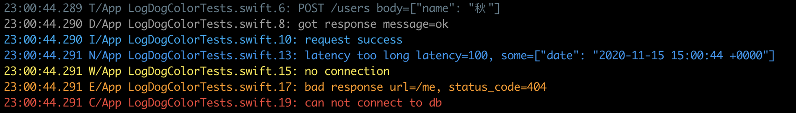

# LogDogChalk

Color the output of LogDog.




## Usage

```swift
let logger = Logger(label: "App") { label in
    let sink = LogFormatters.BuiltIn(style: .medium).suffix("\n").color()
    return SugarLogHandler(label: label, sink: sink, appender: TextLogAppender.stdout)
}
```
